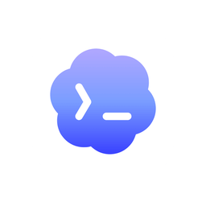

<div align="center">



# OpenNotch Agent

### Dynamic notch control center for **Codex + Claude Code** on macOS

<p>
  
  
  
</p>

</div>

---

## What it is

OpenNotch Agent keeps your AI coding sessions visible and actionable from the notch.

- Approve or reject tool actions without switching terminal tabs.
- Monitor parallel Codex and Claude sessions across projects.
- Open expanded chat and tool timelines from one compact control surface.

## Product identity

<div align="center">
  
  &nbsp;&nbsp;&nbsp;&nbsp;
  
</div>

- **Brand name:** OpenNotch Agent
- **Primary visual:** Codex-blue iconography and gradients
- **Secondary visual:** Claude orange accents where Claude sessions are active

## Core features

### Notch-native approvals

Permission requests surface directly in the notch with provider-aware actions.

### Multi-provider session tracking

Codex and Claude are normalized into one session model, with clear provider grouping and visual separation.

### Expanded conversation timeline

Both providers support timeline-style chat and tool-call history in the expanded view.

### Reliable tmux targeting

Action routing resolves by `tty` → `pid` → `cwd` fallback for stronger reliability.

## Requirements

- macOS 15.6+
- Codex CLI and/or Claude Code CLI
- Accessibility permissions enabled for terminal and focus automation

## Quick start

```bash
git clone https://github.com/zabrodsk/opennotch-agent.git
cd opennotch-agent
open ClaudeIsland.xcodeproj
```

Build from terminal:

```bash
xcodebuild -scheme ClaudeIsland -configuration Release build
```

## Architecture notes

- Claude events flow through local hook scripts in `~/.claude/hooks/`.
- Codex sessions are discovered from `~/.codex/sessions/**/rollout-*.jsonl`.
- A local socket server powers approval roundtrips and status updates.

## Privacy

Mixpanel is used for lightweight anonymous lifecycle analytics (launch/session state). Conversation content is not sent to analytics.

## License

Apache 2.0
